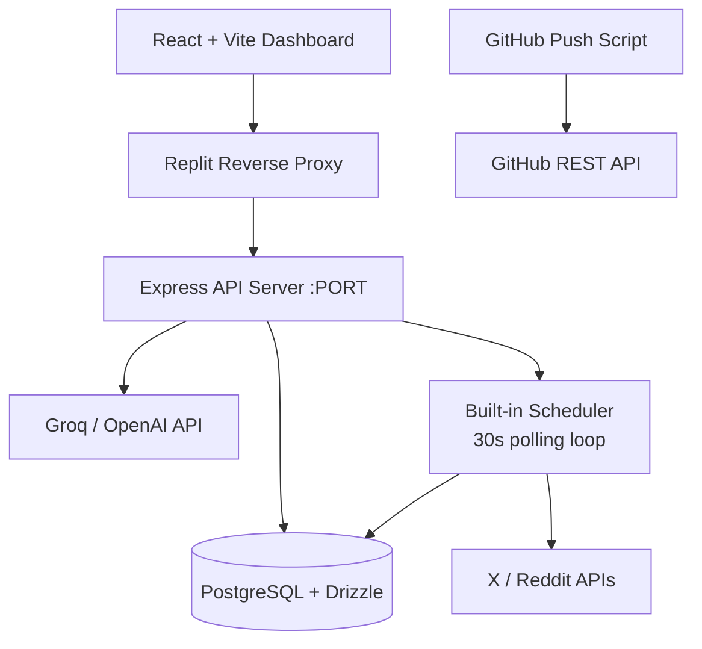

# SocialCommander

> AI-powered social media management dashboard for power users managing multiple X (Twitter) and Reddit accounts.

```
 _______ _______ _______ ___ ___ _______ _        _______ _______ ___ ___  ___ ___  ___ _______ _______ _______ _______ 
|   _   |       |       |   |   |   _   |  |      |       |       |   |   ||   |   ||   |   _   |       |       |       |
|  |_|  |   _   |       |   |   |  |_|  |  |      |       |   _   |   |   ||   |   ||   |  |_|  |       |       |   _   |
|       |  | |  |       |   |   |       |  |      |       |  | |  |   |   ||   |   ||   |       |       |       |  | |  |
|       |  |_|  |      _|   |   |       |  |___   |      _|  |_|  |   |   ||   |   ||   |       |      _|      _|  |_|  |
|   _   |       |     |_|       |   _   |       | |     |_|       |       ||       ||   |   _   |     |_|     |_|       |
|__| |__|_______|_______|_______|__| |__|_______| |_______|_______|_______||_______||___|__| |__|_______|_______|_______|
```

## What It Does

SocialCommander is a self-hosted dashboard for managing up to 10 X (Twitter) + 10 Reddit accounts with:

- **Unified content calendar** across all accounts
- **AI-powered content generation** with per-account voice matching (via Groq)
- **Automated scheduling** with human-like jitter randomization
- **Background job queue** with retry logic and failure tracking
- **Analytics dashboard** with engagement heatmaps and time series charts
- **Per-account isolation**: color-coded, with proxy support and status monitoring
- **Audit log** for full action traceability

## Architecture Overview



## Stack

| Layer | Technology |
|-------|-----------|
| Frontend | React 18 + Vite + TypeScript + Tailwind + shadcn/ui + Recharts |
| Backend | Express 5 + TypeScript |
| Database | PostgreSQL + Drizzle ORM |
| Validation | Zod (OpenAPI-generated) |
| AI | Groq (llama-3.1-8b-instant) / OpenAI-compatible |
| Scheduling | In-process 30s polling loop (BullMQ-ready) |
| Monorepo | pnpm workspaces |

## Quick Start

### 1. Set Environment Secrets (Replit)

In the **Secrets** tab of your Replit project, add:

| Secret | Required | Description |
|--------|----------|-------------|
| `GROQ_API_KEY` | Optional | For AI content generation. Get free key at [console.groq.com](https://console.groq.com) |
| `GITHUB_TOKEN` | Optional | For GitHub push script. Needs `repo` scope |
| `GITHUB_REPO` | Optional | Target repo as `owner/reponame` |
| `SESSION_SECRET` | Recommended | Random string for session security |

The database (`DATABASE_URL`, `PGHOST`, etc.) is automatically provided by Replit.

### 2. Run the App

Click **Run** in Replit, or:

```bash
# API server
pnpm --filter @workspace/api-server run dev

# Frontend dashboard
pnpm --filter @workspace/dashboard run dev
```

### 3. Push to GitHub

```bash
# Set GITHUB_TOKEN and GITHUB_REPO in Replit Secrets first
pnpm --filter @workspace/scripts run push-to-github

# Or with env vars:
GITHUB_REPO=myuser/socialcommander pnpm --filter @workspace/scripts run push-to-github
```

The script:
- Creates the repo on GitHub if it doesn't exist (private by default)
- Initializes git, sets the remote, commits all files, and pushes
- Is fully idempotent — safe to run multiple times

## Project Structure

```
/
├── artifacts/
│   ├── api-server/          # Express 5 backend
│   │   └── src/routes/      # accounts, posts, analytics, ai, queue, audit
│   └── dashboard/           # React + Vite frontend
│       └── src/
│           ├── pages/        # Dashboard, Accounts, Compose, Calendar, Analytics, Queue, Audit
│           └── components/   # Shared UI components
├── lib/
│   ├── api-spec/             # OpenAPI 3.1 spec (source of truth)
│   ├── api-client-react/     # Generated React Query hooks
│   ├── api-zod/              # Generated Zod validation schemas
│   └── db/                   # Drizzle ORM schema + client
│       └── src/schema/       # accounts, posts, queue_jobs, audit_logs
├── scripts/
│   └── src/push-to-github.ts # Idempotent GitHub push script
├── .env.example              # Environment variable template
├── ARCHITECTURE.md           # Deep architecture notes
├── RISKS.md                  # Ban risks, legal notes, TOS warnings
└── TODO.md                   # Extension roadmap
```

## API Endpoints

Base URL: `/api`

| Method | Path | Description |
|--------|------|-------------|
| GET | `/healthz` | Health check |
| GET | `/accounts` | List accounts (filter: platform, status) |
| POST | `/accounts` | Add account |
| GET | `/accounts/overview` | Aggregate counts |
| GET/PATCH/DELETE | `/accounts/:id` | Account CRUD |
| GET | `/accounts/:id/stats` | Per-account post stats |
| GET | `/posts` | List posts (filter: accountId, status, platform) |
| POST | `/posts` | Create post |
| GET | `/posts/calendar` | Calendar view |
| GET | `/posts/recent` | Recent published posts |
| GET/PATCH/DELETE | `/posts/:id` | Post CRUD |
| POST | `/posts/:id/publish` | Publish immediately |
| POST | `/posts/:id/schedule` | Schedule with optional jitter |
| GET | `/analytics/overview` | Aggregate metrics |
| GET | `/analytics/account-metrics` | Per-account analytics |
| GET | `/analytics/heatmap` | 7×24 engagement heatmap |
| GET | `/analytics/timeseries` | Time series data |
| POST | `/ai/generate` | AI content generation |
| POST | `/ai/optimize-time` | Optimal posting time suggestions |
| GET | `/queue/jobs` | List background jobs |
| GET | `/queue/stats` | Queue health |
| GET | `/audit` | Audit log |

## Deployment

### Replit (current)
Everything runs automatically. Click **Publish** to deploy.

### Self-hosted / VPS
See `ARCHITECTURE.md` for Docker Compose setup.

### Railway
1. Connect your GitHub repo to Railway
2. Set all env vars from `.env.example`
3. Deploy the monorepo — Railway auto-detects pnpm

## Extending This Project

See `ARCHITECTURE.md` for a full extension guide. Key extension points:

- **Add a platform**: Add new enum value in `lib/db/src/schema/accounts.ts`, add routes in `artifacts/api-server/src/routes/`
- **Add BullMQ**: Replace the in-process scheduler in `artifacts/api-server/src/routes/queue.ts` with BullMQ queues
- **Add Playwright**: Add a `workers/` package with Playwright stealth for cookie-based posting
- **Add OAuth**: Add OAuth token exchange in a new `auth` route

## Risk Warning

> **READ `RISKS.md` BEFORE DEPLOYING.**
> Automated multi-account posting violates X and Reddit ToS and may result in account bans.
> This tool is for educational purposes. Use at your own risk.
